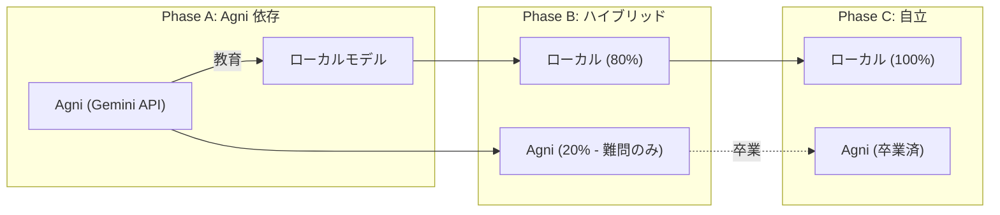

# 技術の壁 攻略計画 - 分析レポート

## 概要
`docs/技術の壁.md` で定義された4つの壁を、Agniの役割を含めて順番に攻略する戦略。

---

## 壁1: 結合問題 (Binding Problem)

### 現状
| コンポーネント | 実装状況 | 課題 |
|:---|:---|:---|
| SimHash | ✅ 768→1024bit | ノイズ蓄積は未検証 |
| KD-Tree | ✅ 空間索引 | 次元数固定 |
| XOR結合 | ❌ 未実装 | 意味結合アルゴリズム不在 |

### Agniの役割
```
Agni → 「概念A + 概念B = 概念C」の結合パターンをGeminiから取得
    → GeologicalMemory に結合テンプレートとして保存
    → ローカルで再現可能な結合ルールを学習
```

### 提案実装
1. **Binding Operator**: XOR + 置換行列による可逆結合
2. **Agni Binding Tutor**: Geminiから「概念結合の正解例」を取得し、ローカルモデルを訓練

---

## 壁2: 出力のボトルネック (Language Grounding)

### 現状
| コンポーネント | 実装状況 | 課題 |
|:---|:---|:---|
| Chimera Engine | ✅ テンプレート+スロット | ロボットっぽい |
| 形態素解析 | ✅ janome | 生成能力なし |
| 構文木生成 | ❌ 未実装 | 文法制約なし |

### Agniの役割
```
Agni → 内部状態を「Agniに言語化させる」(翻訳者モード)
    → 生成された文を「サンプル」として Chimera Engine に学習させる
    → 徐々にローカル生成精度を向上
```

### 提案実装
1. **Agni Translator**: 内部ベクトル/ホルモン状態 → 自然文
2. **Chimera v2**: Agniの出力を模倣するパターン学習

---

## 壁3: 可塑性と安定性のジレンマ (Plasticity-Stability)

### 現状
| コンポーネント | 実装状況 | 課題 |
|:---|:---|:---|
| SedimentaryCortex | ✅ 圧縮 | 閾値調整未検証 |
| Dream Engine | ✅ 睡眠時統合 | 選別ロジック単純 |
| Valence Decay | ✅ 時間減衰 | 重要度無視 |

### Agniの役割
```
Agni → 「この記憶は重要か？」の判断基準を提供
    → 重要度ラベル付き記憶をGeminiで生成
    → ローカルの「重要度判定器」を訓練
```

### 提案実装
1. **Importance Classifier**: 記憶の重要度スコア (0-1)
2. **Selective Consolidation**: 重要度が高い記憶を優先的に固定

---

## 壁4: 文脈の維持と注意 (Context & Attention)

### 現状
| コンポーネント | 実装状況 | 課題 |
|:---|:---|:---|
| AttentionManager | ✅ 視覚注意 | 文脈履歴なし |
| 予測符号化 | ✅ Gatekeeper | 連想制御なし |
| Context Buffer | ❌ 未実装 | 会話履歴保持なし |

### Agniの役割
```
Agni → 「今の文脈は何？」のメタ判断を提供
    → 文脈ラベル（食事/探索/危険回避など）をGeminiで分類
    → ローカルの「文脈分類器」を訓練
```

### 提案実装
1. **Context Buffer**: 直近N個の概念を保持するリングバッファ
2. **Context Classifier**: 現在の文脈ラベルを推定
3. **Association Gate**: 文脈外の連想を抑制

---

## 戦略: Agni 依存から自立へ



---

## 優先順位

| 壁 | 難易度 | 影響度 | 推奨順序 |
|:---:|:---:|:---:|:---:|
| 1 | ⭐⭐⭐⭐ | ⭐⭐⭐ | 3番目 |
| 2 | ⭐⭐⭐ | ⭐⭐⭐⭐ | **1番目** |
| 3 | ⭐⭐⭐ | ⭐⭐⭐ | 4番目 |
| 4 | ⭐⭐ | ⭐⭐⭐⭐ | **2番目** |

**推奨攻略順序**: 壁2 → 壁4 → 壁1 → 壁3

---

*Generated for 技術の壁 攻略計画*
