# Geode-Engine Architecture

## Overview

Geode-Engine implements a biologically-inspired cognitive architecture using the **Free Energy Principle** and **Geological Memory** metaphors.

```mermaid
graph TB
    subgraph "🧠 Brain Core"
        Brain["GeodeBrain"]
        Motor["MotorCortex"]
        Sensory["SensoryCortex"]
        Dream["DreamEngine"]
    end
    
    subgraph "💉 Body Systems"
        Hormones["HormoneManager"]
        Metabolism["MetabolismManager"]
    end
    
    subgraph "🗄️ Memory"
        GeoMem["GeologicalMemory"]
        Sediment["SedimentaryCortex"]
    end
    
    subgraph "👁️ Senses"
        Visual["VisualBridge"]
        Agni["AgniAccelerator"]
    end
    
    Brain --> Motor
    Brain --> Sensory
    Brain --> Dream
    Brain --> Hormones
    Brain --> Metabolism
    Brain --> GeoMem
    Sensory --> Visual
    Brain --> Agni
```



---

## Core Components

### 1. GeodeBrain (`src/brain_stem/brain.py`)

The central coordinator that orchestrates all cognitive processes.

**Responsibilities:**
- Initialize all subsystems
- Run the main cognitive loop
- Handle event routing

**Key Methods:**
- `think()` - Main cognitive cycle
- `receive_sense()` - Process sensory input
- `save_memory()` - Persist state

---

### 2. GeologicalMemory (`src/cortex/memory.py`)

Long-term memory system using geological metaphors.

**Concepts:**
- **Sedimentation**: New memories deposit on existing layers
- **Erosion**: Unused memories fade
- **Fossils**: Important events permanently embedded

**Data Structure:**
```python
concepts = {
    "concept_name": [x, y, timestamp, access_count, valence]
}
```

---

### 3. HormoneManager (`src/body/hormones.py`)

Simulates neuromodulator dynamics affecting behavior.

**Hormones:**
| Hormone | Role |
|:---|:---|
| Dopamine | Reward, motivation |
| Cortisol | Stress response |
| Serotonin | Mood, well-being |
| Adrenaline | Fight-or-flight |
| Oxytocin | Social bonding |

---

### 4. Modular Cortices (Phase 15)

Separated from the main brain for maintainability:

| Module | File | Responsibility |
|:---|:---|:---|
| MotorCortex | `motor_cortex.py` | Movement decisions |
| SensoryCortex | `sensory_cortex.py` | Perception processing |
| DreamEngine | `dream_engine.py` | Autonomous thought |
| MetabolismManager | `metabolism.py` | Energy management |

---

## Data Flow

```
Sensory Input → SensoryCortex → GeologicalMemory
                     ↓
              HormoneManager ← MotorCortex → Action Output
                     ↓
              DreamEngine (during idle)
```

---

## Design Principles

1. **Dependency Injection**: Modules receive dependencies via constructor
2. **Single Responsibility**: Each module has one clear purpose
3. **Stateless Computation**: Cortices compute, don't hold state
4. **Biological Metaphors**: Architecture mirrors brain anatomy

---

## Configuration

All tunable parameters are in `src/dna/config.py`:

```python
# Hormone Thresholds
THRESHOLD_LOW = 30.0
THRESHOLD_HIGH = 70.0

# Memory Settings
MEMORY_DECAY_RATE = 0.001
MEMORY_SAVE_INTERVAL = 300

# Agni Settings
EDUCATION_MODE = False
AGNI_RATE_LIMIT = 15  # RPM
```

---

## Extension Points

### Adding a New Cortex Module

1. Create `src/brain_stem/your_cortex.py`
2. Implement with DI pattern
3. Initialize in `brain.py.__init__()`
4. Add tests in `tests/test_your_cortex.py`

### Adding a New Hormone

1. Add to `Hormone` enum in `hormones.py`
2. Set baseline in `brain.py`
3. Define decay rate in `config.py`
