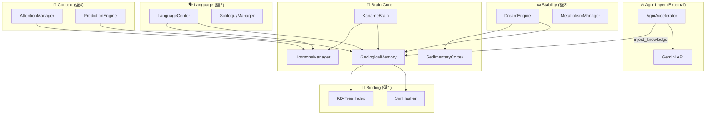

# 技術の壁 攻略計画 - 依存関係マップ

## コンポーネント間依存関係



---

## 壁ごとの依存関係

### 壁1: 結合問題
```
SimHasher <-- GeologicalMemory <-- AgniAccelerator
         <-- LanguageCenter (検索時)
```
**影響範囲**: 記憶の保存/検索すべて

### 壁2: 出力ボトルネック
```
LanguageCenter <-- Hormones (テンプレート選択)
               <-- Memory (スロット埋め)
               <-- Soliloquy (独り言生成)
               <-- Agni (翻訳依頼 - 新規)
```
**影響範囲**: すべての発話出力

### 壁3: 可塑性/安定性
```
DreamEngine <-- Memory
            <-- SedimentaryCortex
            <-- Hormones (睡眠トリガー)
```
**影響範囲**: 記憶の永続化

### 壁4: 文脈と注意
```
AttentionManager <-- Hormones
                 <-- VisualBridge (視覚入力)
PredictionEngine <-- Memory (予測符号化)
```
**影響範囲**: 入力フィルタリング、連想制御

---

## クリティカルパス

| 壁 | 最も影響を受けるコンポーネント | リスク |
|:---:|:---|:---|
| 1 | GeologicalMemory | 全システム停止 |
| 2 | LanguageCenter | 出力なし |
| 3 | Memory + Cortex | 記憶喪失 |
| 4 | AttentionManager | 暴走 |

---

*Generated for 技術の壁 攻略計画*
